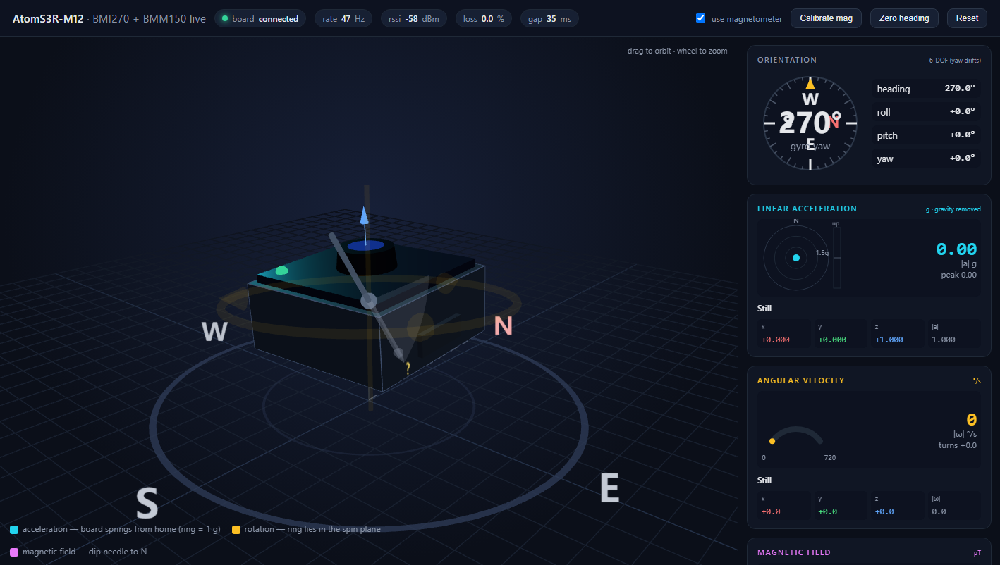

# AtomS3R-M12 IMU Dashboard

Stream accelerometer, gyroscope, and magnetometer data over Wi-Fi to a live 3D dashboard.



**You need:** an AtomS3R-M12, a USB-C **data** cable, 2.4 GHz Wi-Fi, Arduino IDE 2.x, and Python 3.8+ (no extra Python packages).

## 1. Set up Arduino IDE

Add this URL under **File > Preferences > Additional Boards Manager URLs**:

```text
https://static-cdn.m5stack.com/resource/arduino/package_m5stack_index.json
```

- In **Boards Manager**, install **M5Stack 2.1.4**.
- In **Library Manager**, install **M5Unified 0.2.20** and **M5GFX 0.2.29**.
- Select **Tools > Board > M5Stack > M5AtomS3R**, then check:

| Tools option | Value |
| --- | --- |
| Flash Size | 8MB (64Mb) |
| Flash Mode | QIO 80MHz |
| PSRAM | OPI PSRAM |
| Partition Scheme | 8M with spiffs (3MB APP/1.5MB SPIFFS) |
| USB Mode | Hardware CDC and JTAG |
| USB CDC On Boot | Enabled |
| Upload Mode | UART0 / Hardware CDC |

## 2. Enter your own Wi-Fi credentials

In [`ino/AtomS3R_M12_IMU_Dashboard/`](ino/AtomS3R_M12_IMU_Dashboard/), **copy** `secrets.example.h` to `secrets.h`. Choose one of the two configuration blocks in that file:

**Option A — eduroam (default):** leave Option A enabled and fill in your credentials:

```cpp
#define WIFI_SSID      "eduroam"
#define EAP_IDENTITY   "YOUR_MYID@uga.edu"
#define EAP_USERNAME   "YOUR_MYID@uga.edu"
#define EAP_PASSWORD   "YOUR_MYID_PASSWORD"
```

Use your own UGA MyID in both identity fields. **Keep `secrets.h` private:** it is ignored by Git; never put real passwords in `secrets.example.h`.

`EAP_CA_CERT` accepts your university's RADIUS CA certificate; leaving it empty disables server certificate verification.

**Option B — ordinary Wi-Fi (2.4 GHz home router or phone hotspot):** comment out all five `#define` lines in Option A and uncomment all five in Option B. Fill in `WIFI_SSID` and `WIFI_PASSWORD`, and keep `EAP_USERNAME` as `""` to select ordinary Wi-Fi. Leave the shared `EAP_CA_CERT` definition in place; this mode ignores it.

Only one option should be uncommented at a time. Keep your computer and board on the same reachable local network.

## 3. Compile and upload

1. Open [`AtomS3R_M12_IMU_Dashboard.ino`](ino/AtomS3R_M12_IMU_Dashboard/AtomS3R_M12_IMU_Dashboard.ino) in Arduino IDE.
2. Connect the board by USB and select its port under **Tools > Port**.
3. Click **Verify** to compile, then **Upload** to flash the board.
4. Open **Serial Monitor** at **115200 baud**, then **briefly press Reset once** to start the program and see its logs.

If upload cannot start, **hold Reset for about 2 seconds until the green LED lights, then release**. Select the board's port again and retry Upload. A long press enters download mode; a short press starts the application.

After changing `secrets.h`, compile and upload again.

## 4. Find the IP and open the dashboard

Wait for these lines in Serial Monitor:

```text
[wifi] status   : connected to eduroam
[wifi] local IP : 172.21.1.23
```

Copy **your board's IP**. On your computer, open a terminal in the **`Demo-AtomS3R-M12` folder** and run the following, replacing the example IP:

```bash
python backend/server.py 172.21.1.23
```

Use `python3` if that is your Python command. The backend automatically opens [http://localhost:8000](http://localhost:8000); you can also open that link yourself.

Keep the board powered and the terminal running. Your computer must be able to reach the board over the local network. Press **Ctrl+C** in the terminal to stop the backend. Recheck the IP after reconnecting the board.

## 5. Try it

Rotate the board to see the 3D model and sensor values change. For compass calibration, click **Calibrate mag**, slowly rotate the board through all orientations for about 15 seconds, then click it again. **Zero heading** sets your current direction to zero.

## Quick fixes

- **No Wi-Fi IP:** check your credentials and 2.4 GHz network access.
- **Page opens but no data:** check the board IP, allow Python through the local firewall, and move closer to the Wi-Fi access point. Campus client isolation may require a hotspot.
- **Port 8000 is busy:** add `--port 8080` to the backend command and open [http://localhost:8080](http://localhost:8080).

Adapted from [Demo-AtomS3R-CAM](https://github.com/Pervasive-Intelligence-Lab/Demo-AtomS3R-CAM). Bundled three.js retains its [MIT license](web/vendor/LICENSE.three.txt).
